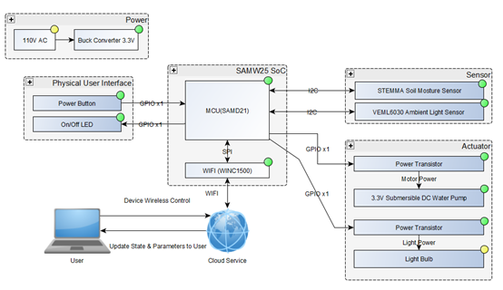

# DFM-IoT-Irrigation-System-PCBA
This is the output file from Altium Designer from ESE516 class
## What it does
We decided to make a smart irrigation system which could measure the moisture level of soil and irrigate it when it is too dry.

## Inspiration
This device is designed for people who love gardening but travel a lot. Once the device is installed, while the user is away from home, it could alert the user when the soil moisture level drops below a certain threshold, and the user could remotely control the device to water the plants, or to let the device decide when to irrigate the plants.

## How we built it
In this project, we followed the top-down design scheme. So, in the first place, we designed the overall functionalities of the system as shown in the system block diagram. The system is based on the SAMW25 MCU, and it communicate with the soil moisture sensor and the ambient light sensor via I2C and drive the pump and LED array with GPIO. Also, the MCU has the WINC1500 WIFI module so we used this feature to build an IoT product.

Then we captured the schematics, and started PCBA layout in Altium Designer. The schematic and PCB layout are on the image files above. In the schematics, we used the hierarchical subsheet structure to simplify the main schematic and make it easy to read.

Then we selected proper components and layout them onto the PCBA file. We implemented our design in a 4 layers PCB. It’s quite an interesting experience of designing the PCB, and after that we send this PCB design to PCBWAY, a manufacture in Shenzhen China, to print it out.

After the hardware design, we started on the software side, which we implemented a bootloader, and utilized the FreeRTOS system on our project. Also, our board has command line interface, which we can type some instructions to the terminal and readout the sensor values (soil moisture sensor, IMU, ultrasonic sensor, etc.). Since it’s an IoT project, we implemented web interface (via NodeRed and IBM cloud) as well. The upstream data are being transmitted to the MQTT broker server first and then to the NodeRed interface, which is powered by IBM cloud. We can read sensor value and history in the web interface, as shown in picture above.

## Challenges we ran into
The first challenge we met is the shortage of the parts we need. When it comes to select our parts, we have to update our BOM frequently, because some parts may be out of stock after a day. The second challenge we encountered is the design of our PCB board. Since it’s our first time to design the PCB board, it’s really hard for us to make the components clear and neat at the beginning. Fortunately, we finally improve the layout of our board to be clear and neat with the professor’s advice.

In addition, due to the Covid-19, the manufacture could not deliver our PCB board on time. Thus, we have to use SAMD21 board and don’t have time to debug our own board. Moreover, we struck into using ADC library with our soil moisture sensor. At the beginning, we couldn’t print a correct value of the output of our sensor. Also, we faced a challenge about sending message to MQTT and showing the value of the soil moisture sensor in a chart in Node Red.

## Accomplishments we are proud of
-A cool PCB board. -A system which can automatically water flowers according to the humidity. -Successfully implement ADC library and make the MCU constantly read the output of the soil moisture sensor. -Build an UI dashboard in Node Red -Apply FreeRTOS to do multi-thread tasks.

## What we learned:
-Basic knowledge about PCB board and its layout and design our own PCB board using Altium Designer. -Make the system do multi-tasks simultaneously -Design a PCB board using Altium Designer -Apply Mutex and Semaphore of FreeRTOS -Implement ADC library on SAMW 25 -Send sensor’s data to cloud using MQTT and Node Red

## What’s next:
We plan to add an ambient light sensor and test the whole project on our new board

## Limitation
In this project, we did not complete all the designated functionalities we plan to have, which namely, we have trouble interfacing with the ambient light sensor. After several days and nights of fighting the sensor driver, we decided to gave up on it and only have the soil moisture sensor and water pump functionalities. Also, due to the global pandemic, our boards shipment has been delayed by 2 weeks, so we did not get it on time for this project, so we implemented our project on the SAMW25 Xplained Pro development board instead.
